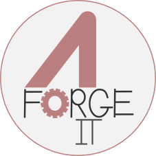

# 4i

4i is a **Model-Oriented Programming** and **Meta-Programming** orchestration tool, you can use it to create models and generate codes. It makes possible for programmers to build there own modules from-scratch or just extend some existing ones.

## Hello World

Here is the common ["hello world" example](https://github.com/4geit-project/hello) in action. It's basically based on the module [4i.language.python.hello](https://github.com/4geit-module/4i.language.python.hello) which extends the module [4i.language.python](https://github.com/4geit-module/4i.language.python) which extends the module [4i.language](https://github.com/4geit-module/4i.language) which extends the root module [4i](https://github.com/4geit-module/4i).

Watch asciicast to quickly see how the hello world project is build with 4i:

## Development state

Software is still under development but it is already used internally. An active work is ongoing to make 4i as good as possible for any developer backgrounds.

However it is hoped to build a module hosting platform in a near future according to the following roadmap:

1. Several primitive modules will be released such as programming languages (c++, python, html, ...) easier and high and low level development framework (django, flask, boost, ...).
2. A documention generator for libraries and modules will be integrated to ease the user adaptation.
3. A test and behavior driven development process will be added as part of the modules protocol.
4. A module hosting platform that will enable users to pull-push modules, to extend modules based on other modules and share them with others.
5. A project hosting platform to assemble modules, host projects and deploy them.

## Going further

### Documentation

Coming soon...

### Talk about/get involved in 4i project

If you wish to participate/debate on 4i, you can:

* join the discussion group: https://groups.google.com/forum/?hl=fr#!forum/4geit-4i
* contact me directly at caner@4ge.it

## Resources

Resources are available at these links:

* [4geit-tool](https://github.com/4geit-tool)
* [4geit-core](https://github.com/4geit-core)
* [4geit-module](https://github.com/4geit-module)
* [4geit-project](https://github.com/4geit-project)

## References

* [GSL - a Universal Code Generator](https://github.com/imatix/gsl)

## License

This software is provided under [GPLv3](LICENSE).
